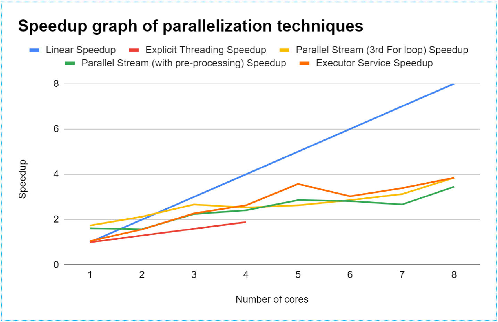

# Promoter
## parallel-project-CAB401

## My Speedup Graph

<figure><figcaption align="center"> Figure: Speedup achieved in this project</figcaption></figure>

**IMPORTANT: Don't copy exactly as you will be subject to academic misconduct.** Please modify the variables, re-paraphrase, delete comments, add/remove lines, etc. before submitting yours.
To write a more comprehensive report, look through all the materials just like you are revising for exam so that you can remind yourself of the areas you may forget!  
I achieved 50/50 with this report.  

## Instructions to run app with each technique  
Step 1: Open Zip file and open the folder with IntelliJ  
Step 2: Open src > qut  
Step 3: Now we are in qut directory:  
- To use Sequential code, run Sequential.java
- To use Explicit Threading Technique, run ExplicitThreading class in ExplicitThreading.java
- To use Parallel Stream 3rd For loop / Parallel Stream with pre-processing / Executor Service, uncomment the 1 method you want to run at line 272 (and threadNum parameter to run on [threadNum] threads) in Parallel.java and run main function.   

Step 4: To test the result, you similarly uncomment the 1 method you want to run and run the test you want. Tests provided are:
- Compare a Parallel technique’s consensus with consensus from analyzing default dataset
- Compare ExplicitThreading technique’s consensus with consensus from analyzing default dataset
- Compare a Parallel technique’s consensus with Sequential code’s
- Compare a Parallel technique’s consensus with Sequential code’s 
